### Counting dots?


```{r pps,fig.width=15,fig.height=5}
library(spatstat)
set.seed(4321)
locs <- cbind(runif(100),runif(100))
pp <- ppp(locs[,1], locs[,2])
win <- owin()
par(mfrow = c(1,3), mar = c(0,0,0,0))
## point pattern
plot(locs,axes = "F",pch = 20,xlab = "",ylab = "",xlim = c(0,1),ylim = c(0,1),col = "darkgrey")
plot(win,add = TRUE)
## quadrat count
plot(locs,axes = "F",pch = 20,xlab = "",ylab = "",xlim = c(0,1),ylim = c(0,1),col = "darkgrey")
plot(win,add = TRUE)
q <- quadratcount(pp,5,5)
plot(q,add = TRUE,cex = 1.5)
## quad count finer matrix
plot(locs,axes = "F",pch = 20,xlab = "",ylab = "",xlim = c(0,1),ylim = c(0,1),col = "darkgrey")
plot(win,add = TRUE)
q <- quadratcount(pp,10,10)
plot(q,add = TRUE,cex = 1.5)
```


---
# Cancer work

---
.center[
```{r, fig.align='center', out.width="100%"}
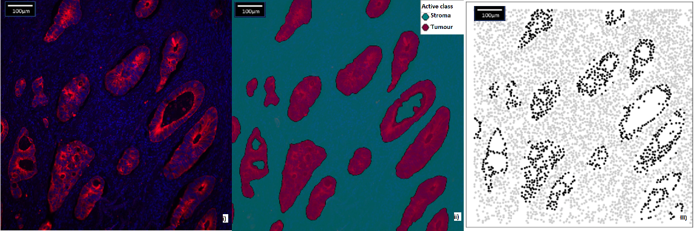
```
]
---

.center[
```{r, fig.align='center', out.width="100%"}
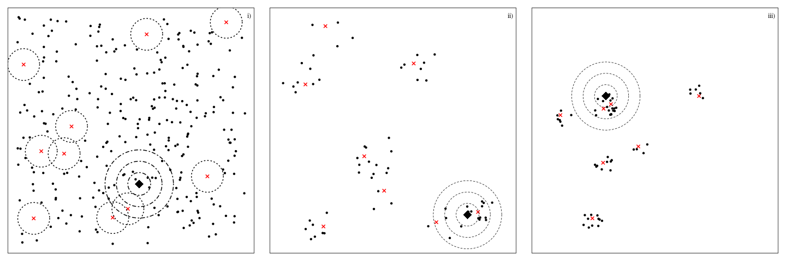
```
]
---

.center[
```{r, fig.align='center', out.width="100%"}
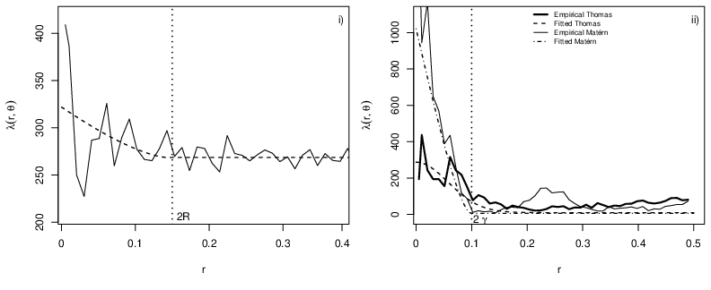
```
]
---
# But what about unexplained stucture...
---

### Remember


```{r ppr,fig.width=15,fig.height=5}
library(spatstat)
set.seed(4321)
locs <- cbind(runif(100),runif(100))
pp <- ppp(locs[,1], locs[,2])
win <- owin()
par(mfrow = c(1,3), mar = c(0,0,0,0))
## point pattern
plot(locs,axes = "F",pch = 20,xlab = "",ylab = "",xlim = c(0,1),ylim = c(0,1),col = "darkgrey")
plot(win,add = TRUE)
## quadrat count
plot(locs,axes = "F",pch = 20,xlab = "",ylab = "",xlim = c(0,1),ylim = c(0,1),col = "darkgrey")
plot(win,add = TRUE)
q <- quadratcount(pp,5,5)
plot(q,add = TRUE,cex = 1.5)
## quad count finer matrix
plot(locs,axes = "F",pch = 20,xlab = "",ylab = "",xlim = c(0,1),ylim = c(0,1),col = "darkgrey")
plot(win,add = TRUE)
q <- quadratcount(pp,10,10)
plot(q,add = TRUE,cex = 1.5)
```


---

### How low can you go?

.center[
```{r animation,  fig.show='animate', animation.hook='gifski'}
selected_colours <- get_pal("Kaka")[c(5,3,1)]
cols <- colorRampPalette(selected_colours)(12)
s <- seq(5,50,5)
for(i in 1:length(s)){
  q <- quadratcount(pp,s[i],s[i])
  image(q,axes = FALSE,col = cols)
}
```
]

---

### Continuous?

```{r cont, fig.width = 8, fig.height=8}
image(density(pp)$v,axes = FALSE,col = cols)
points(locs,pch = 20)
```

---
### Random Fiedls

```{r rfs, fig.width=15,fig.height=5, fig.align='center'}
library(spatstat)
spatstat.options(npixel=300)
sigma2x <- c(1,1,3)
kappax <- c(2,3,10)
rangex <- sqrt(8*1)/kappax
beta0 <- 3
library(RandomFields)
set.seed(5432)
fields <- points <- list()
for (i in 1:3){
    lg.s <- rLGCP('matern', beta0,
                  var=sigma2x[i], scale=1/kappax[i], nu=1)
    ## points
    points[[i]] <- cbind(lg.s$x, lg.s$y)[,2:1]
    ## exponential of LGRF
    Lam <- attr(lg.s, 'Lambda')
    fields[[i]] <- log(Lam$v)
}
layout(matrix(c(0,1,2,3,4,
                0,0,0,0),nrow = 2,byrow = TRUE),respect = TRUE,
       widths = c(0.4,3,3,3,3),
       heights = c(3,0.2))

par(mar = c(0,0,0,0),xpd = TRUE,oma = c(0,0,0,0))
x <- seq(1,5, length.out = 100)
plot(x, rSPDE::matern.covariance(x, kappa = kappax[1], nu = 1, sigma = sqrt(sigma2x[1])),
     type = "l", ylab ="", xlab = "",lwd = 2,xaxt = "n")
mtext(line = 0.5, side = 1, "Distances between points")
mtext(line = 2,side = 2, expression(C[z]))
lines(x,rSPDE::matern.covariance(x, kappa = kappax[2], nu = 1, sigma = sqrt(sigma2x[2])), lty = 2,lwd = 2)
lines(x,rSPDE::matern.covariance(x, kappa = kappax[3], nu = 1, sigma = sqrt(sigma2x[3])), lty = 3,lwd = 2)
legend("topright",bty = "n", lty = 1:3,lwd = 2, legend = c("i)","ii)", "iii)"),cex = 2)
## fields
image(fields[[1]],axes = FALSE,  col = RColorBrewer::brewer.pal(9, "Blues"),asp = 1)
points(points[[1]],pch = 20)
legend(-0.05,0.1,bty = "n", cex = 2,legend = "i)")
box()
image(fields[[2]],axes = FALSE,  col = RColorBrewer::brewer.pal(9, "Blues"), asp = 1)
points(points[[2]],pch = 20)
legend(-0.05,0.1,,bty = "n", cex = 2,legend = "ii)")
box()
image(fields[[3]],axes = FALSE,  col = RColorBrewer::brewer.pal(9, "Blues"),asp = 1)
points(points[[3]],pch = 20)
legend(-0.05,0.1,,bty = "n", cex = 2,legend = "iii)")
box()
```

---


### Bed sheets...

.center[
```{r spdefig.height=10,fig.width=10}
library(plotly)
n <- seq(-4,4,length.out = 10)
n <- rep(n, each = 10) 
z <- outer(X = n,Y = n,function(X,Y) sin(X)*cos(Y))
## smoother
n <- seq(-4,4,length.out = 100)
z2 <-  outer(X = n,Y = n,function(X,Y) sin(X)*cos(Y)) + 2

p <- plot_ly(showscale = FALSE) %>%
  add_surface(z = ~z, cmin = min(z), cmax = max(z), colorscale = list(c(0, 1), c("#A8B9CB", "#A7473A"))) %>%
  add_surface(z = ~z2, cmin = min(z2), cmax = max(z2),colorscale = list(c(0, 1), c("#A8B9CB", "#A7473A")), opacity = 0.98) %>%
layout(
    title = "",
    scene = list(
      xaxis = list(title = "",zeroline = FALSE,showline = FALSE,showticklabels = FALSE,showgrid= FALSE),
      yaxis = list(title = "",zeroline = FALSE,showline = FALSE,showticklabels = FALSE,showgrid= FALSE),
      zaxis = list(title = "",zeroline = FALSE,showline = FALSE,showticklabels = FALSE,showgrid= FALSE)
    )) %>% config(displayModeBar = FALSE)
p
```
]

---

### Cutting up space `r emo::ji("knife")`

```{r mesh,fig.height=8,fig.width=8}
library(INLA)
mesh <- inla.mesh.2d(loc = cbind(runif(100),runif(100)),max.edge = c(0.1,0.3),cutoff = 0.07)
image(z2,axes = FALSE,col = cols)
plot(mesh,main = "",add = TRUE)
points(mesh$loc,pch = 20)
```

---
# Other work
---
## Self-exciting fields
---

.center[]

---
## Network distances
---

.center[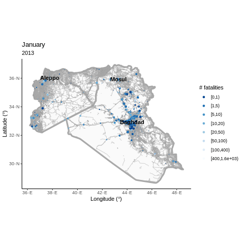]

---

.center[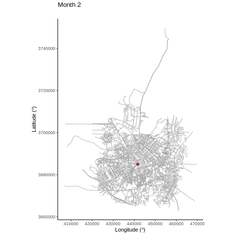]

---
## Marine mammal exposure to Navy sonar
---

### Discrete-space continuous-time


Let $q_{rs}(t,z(t))$ represent the immediate risk of moving from one state $r$ to another state $s$:

$$q_{rs}(t,z(t)) = \text{lim}_{\delta t \rightarrow 0} \mathbb{P}(S(t + \delta t) = s|S(t) = r)/\delta t.$$

These transition rates form a square matrix $\bf{Q}$ with elements $q_{rs}$.

--


Here $q_{rr}=-\Sigma_{s{\neq}r}q_{rs}$ (i.e., the rows of **Q** sum to zero and $q_{rs}\geq0$ for $r{\neq}s$).

--

We have $r, s = \{1,2\}$ where state $1=$ off-range (i.e., outside the area used by the Navy for military operations) and state $2=$ on-range:

$$\begin{array}{ccc}
  \bf{Q} =
  \left [\begin{array}{cc}
    q_{1 1} & q_{1 2} \\
      q_{2 1} & q_{2 2}
    \end{array}\right ] & \text{where} \: q_{r r} = -q_{r s}, & \text{for}\: r \neq s.
  \end{array}$$


---

### Marine mammal exposure to Navy sonar

.center[
```{r track, out.width="50%"}
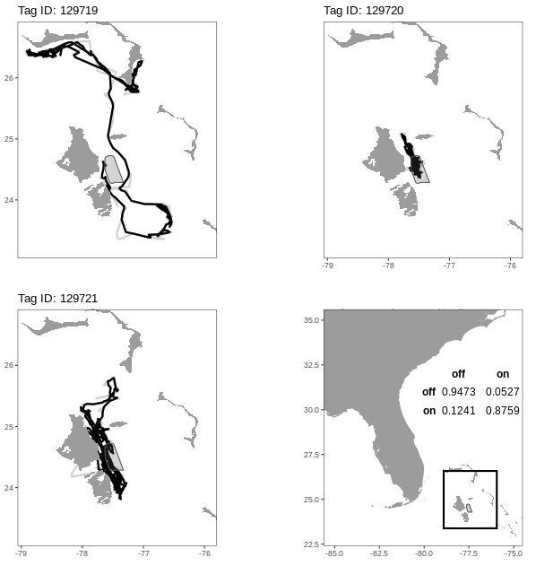
```
]


---

### Marine mammal exposure to Navy sonar

We let 

<br>

$$\text{log}(q_{k, rs}(\mathbf{z}_k(t))) = (\beta_{0,rs} + u_{k, rs}) + \beta_{1,rs}\text{exp}(- \beta_{2,rs} \mathbf{z}_k(t)),$$

where


$$\mathbf{z}_k(t)  \left\{ \begin{array}{rl} = 0 & \text{during exposure} \\ \geq 0 & \text{otherwise}\end{array} \right.$$


is the number of days since an individual was exposed to a sonar event and $\beta_{2,rs} \geq 0$ $\forall\: r \neq s$.


---

```{r echo = FALSE}
library(xaringanExtra)
xaringanExtra::use_panelset()
```


.panelset[
.panel[.panel-name[93232]
.center[
<br>
<br>
```{r, echo = FALSE,fig.height = 3,out.width = "80%"}
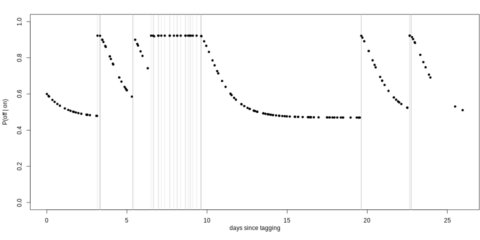
```
]
]
.panel[.panel-name[11164]
.center[
<br>
<br>
```{r, echo = FALSE,fig.height = 3,out.width = "80%"}
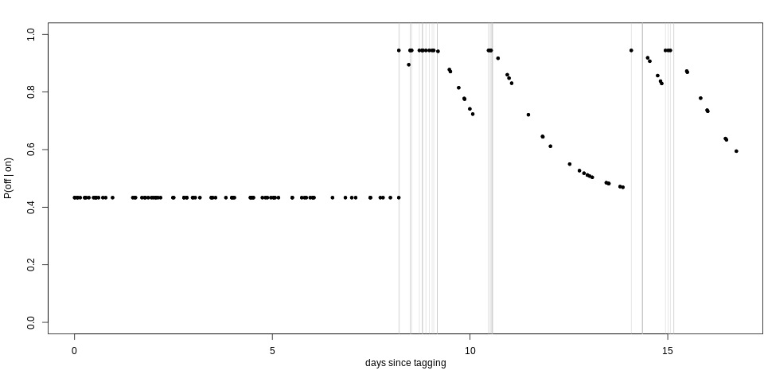
```
]
]
.panel[.panel-name[111670]
.center[
<br>
<br>
```{r, echo = FALSE,fig.height = 3,out.width = "80%"}
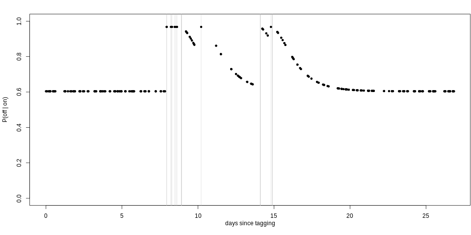
```
]
]
.panel[.panel-name[129715]
.center[
<br>
<br>
```{r, echo = FALSE,fig.height = 3,out.width = "80%"}
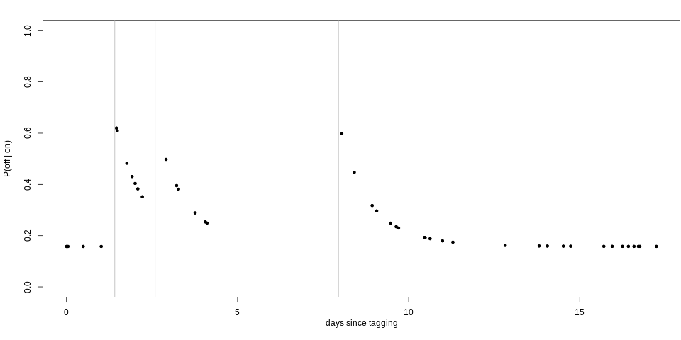
```
]
]
.panel[.panel-name[129719]
.center[
<br>
<br>
```{r, echo = FALSE,fig.height = 3,out.width = "80%"}
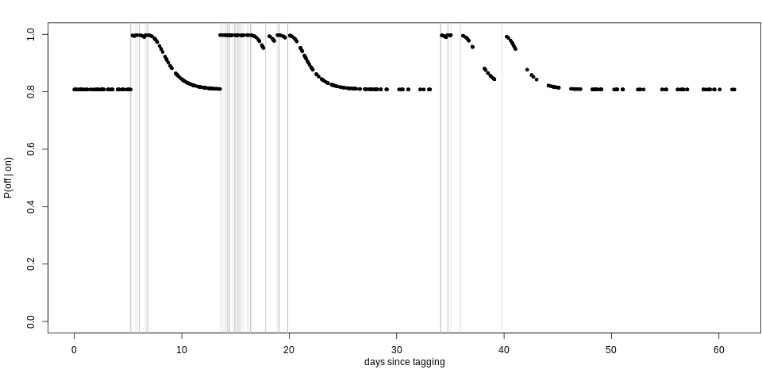
```
]
]
.panel[.panel-name[129720]
.center[
<br>
<br>
```{r, echo = FALSE,fig.height = 3,out.width = "80%"}
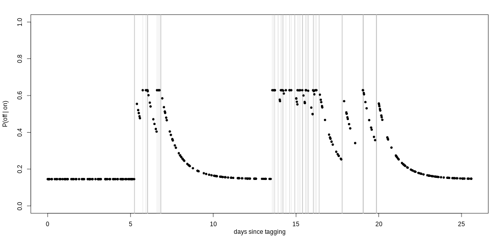
```
]
]
.panel[.panel-name[129721]
.center[
<br>
<br>
```{r, echo = FALSE,fig.height = 3,out.width = "80%"}
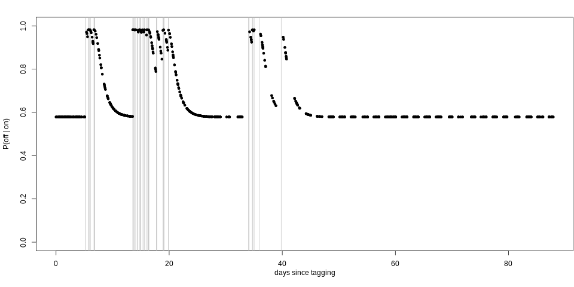
```
]
]
]


---

### References

 + [**Jones-Todd, C. M.**, Caie, P., Illian, J. B., Stevenson, B. C., Savage, A., Harrison D, J., & Bown, J. (2019) Identifying prognostic structural features in tissue sections of colon cancer patients using point pattern analysis. *Statistics in Medicine*, 38 (8), 1421–1441.](https://onlinelibrary.wiley.com/doi/pdf/10.1002/sim.8046)
 
 + [**Jones-Todd, C. M.**, Swallow, B., Illian, J. B., & Toms, M. (2018) A spatio-temporal multi-species model of a semi-continuous response. *Journal of the Royal Statistical Society, Series C (Applied Statistics)*, 67 (3), 705–722.](https://rss.onlinelibrary.wiley.com/doi/full/10.1111/rssc.12250)

 + [Soranio-Redondo, A., **Jones-Todd, C. M.**, Bearhop, S., Hilton, G. M., Lock, L., Stanbury, A., Votier, S. C., & Illian, J. B. (2019) Understanding species distribution in dynamic populations: a new approach using spatio-temporal point process models. *Ecography*, 42 (6), 1092–1102.](https://onlinelibrary.wiley.com/doi/pdf/10.1111/ecog.03771)
 
 + [Python, A.,  Illian, J. B., **Jones-Todd, C. M.**, & Blàngiardo, M. A Bayesian approach to modelling subnational spatial dynamics of worldwide non-state terrorism, 2010–2016. (2019) *Journal of the Royal Statistical Society, Series  A (Statistics in Society)*, 182 (1), 323–344.](https://rss.onlinelibrary.wiley.com/doi/pdfdirect/10.1111/rssa.12384)
 
 + **Jones-Todd, C. M.**, Pirotta, E., Durban, J., Claridge, D., Baird, R., Falcone, E., Schorr, G., Watwood,S., & Thomas, L.  *(Under review after resubmission)* Continuous-time discrete-space models of marine mammal exposure to Navy sonar.

---

### Diolch am wrando 

```{r, eval = FALSE, echo = FALSE}
## linux <sudo apt-get install cowsay>
```

.pull-left[
.animate__animated.animate__bounceInDown[
```{r dragon, echo = FALSE,eval = TRUE, comment = ""}
system2("cowsay", args = "-f dragon 'Questions?'", stdout = TRUE)
```
]
]


.pull-right[
<br>
<br>
<br>
.center[`r icon::fa_twitter(colour = "#00ACEE")` @cmjonestodd]
<br>
.center[`r icon::fa_github()` @cmjt]
<br>
.center[<i class="fas fa-images"></i>  [cmjt.github.io/slides/points](https://cmjt.github.io/slides/points)]
]