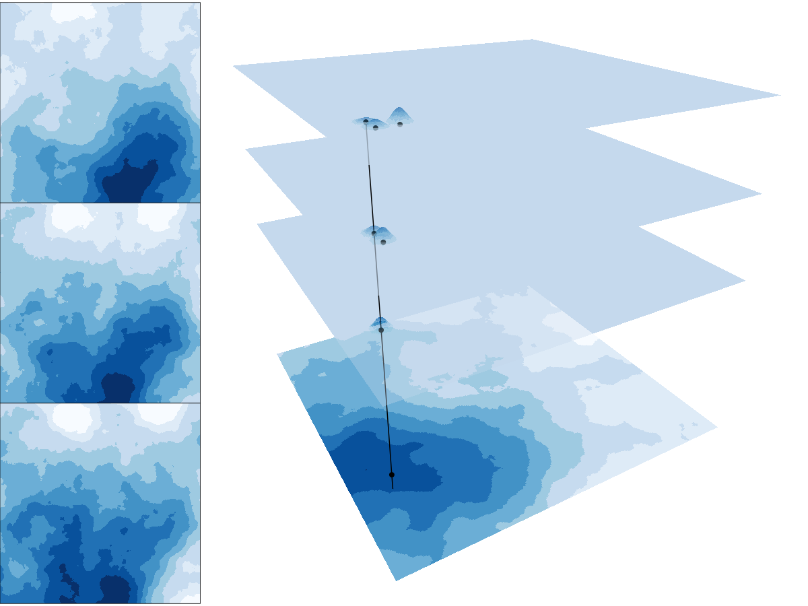

## University of St Andrews

.animate__animated.animate__rollIn.animate__slower[
.pull-left[
```{r, echo=FALSE, out.width="70%",fig.cap="Artwork by @allison_horst"}
knitr::include_graphics("https://raw.githubusercontent.com/allisonhorst/stats-illustrations/master/rstats-artwork/r_first_then.png")
```
]]

.pull-right[

]

---

## NIWA

.animate__animated.animate__rollIn.animate__slower[
.pull-left[
```{r, echo=FALSE, out.width="70%",fig.cap="Artwork by @allison_horst"}
knitr::include_graphics("https://raw.githubusercontent.com/allisonhorst/stats-illustrations/master/rstats-artwork/welcome_to_rstats_twitter.png")
```
]]

.pull-right[

]

---

## NIWA

.pull-right[
```{r, echo=FALSE, out.width="45%"}
knitr::include_graphics("https://www.nesi.org.nz/sites/default/files/media/software%20carpentry%20logo.png")
```
]


.pull-left[

<br>
<br>
<br>
```{r, echo=TRUE, eval = FALSE}
files <- list.files(pattern = ".csv")
files <- lapply(files, read.csv)
res <- do.call('rbind',files)
```
]


--
.overlay[
.pull-left[
```{r, echo=FALSE, out.width="50%",fig.cap="Artwork by @allison_horst"}
knitr::include_graphics("https://raw.githubusercontent.com/allisonhorst/stats-illustrations/master/rstats-artwork/tidyverse_celestial.png")
```
]
]


---


## University of Auckland

.animate__animated.animate__rollIn.animate__slower[
.pull-left[
```{r, echo=FALSE, out.width="70%"}
knitr::include_graphics("https://pics.me.me/yours-is-the-worst-code-ihave-ever-run-but-it-60917985.png")
```
]]

.pull-right[

]
---

## Teaching 

`r icon::fa_desktop()` [cmjt.github.io/statbiscuits](cmjt.github.io/slides/statbiscuits)


---

## Research
.center[
```{r, echo=FALSE, out.width="50%"}
knitr::include_graphics("https://pbs.twimg.com/media/DuKns0KX4AAvApq?format=jpg&name=small")
```
]

---

## Research

.center[
```{r, echo=FALSE, out.width="50%"}

```
]
---

### Vizualising rivers
.center[

]
---

## #dataviz

.center[

]
---

## Unwitting helpers


* @earowang

<iframe src="https://slides.earo.me/rladiesakl20" height="90" frameborder="0"  width="133"></iframe> 

* @annafergussonnz

<iframe src="https://twitter.com/annafergussonnz" height="100" frameborder="0" width="133"></iframe> 
* ...
* basically you put something on `r icon::fa_twitter(colour = "#00ACEE")` or `r icon::fa_github()` and I will steal it


---

## Diolch am wrando

```{r, eval = FALSE, echo = FALSE}
## linux <sudo apt-get install cowsay>
```

.pull-left[
.animate__animated.animate__bounceInDown[
```{r dragon, echo = FALSE, comment = ""}
system2("cowsay", args = "-f dragon 'Questions?'", stdout = TRUE)
```
]
]
.pull-right[
<br>
<br>
<br>
.center[`r icon::fa_twitter(colour = "#00ACEE")` @cmjonestodd]
<br>
.center[`r icon::fa_github()` @cmjt]
<br>
.center[<i class="fas fa-images"></i>  [cmjt.github.io/slides/rladies](cmjt.github.io/slides/rladies)]

]