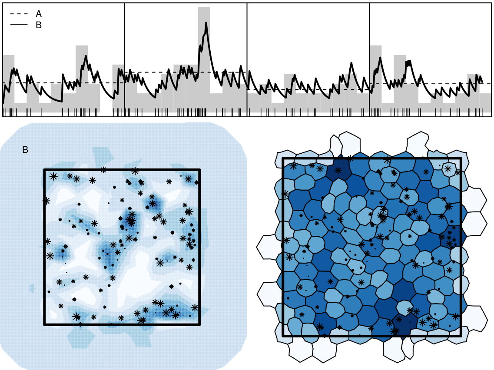

# `r fontawesome::fa(name = "list-check")` `stelfi`

```{r, eval = FALSE}
devtools::install_github("cmjt/stelfi")
stelfi::compile_stelfi()
```


`TMB` (Template Model Builder) is an `R` package for fitting statistical latent variable models. Models are formulated in `C++`. 

`TMB` can calculate first and second order derivatives of the likelihood function by AD, or any objective function written in `C++`. The objective function (and its derivatives) can then be called from `R`. 

The user can specify that the Laplace approximation should be applied to any subset of the function arguments. Yields marginal likelihood in latent variable model. Standard deviations of any parameter, or derived parameter, obtained by the delta method.

---

# ETAS-type model `stelfi::fit_hawkes()`

$$\lambda(t; m(t)) = \mu + \alpha \Sigma_{i:\tau_i<t}m(\tau_i)\text{exp}(-\beta * (t-\tau_i)) $$ 
where $\mu$ is the background rate of the process and $m(t)$ is the temporal mark. Each event $i$ has an associated mark $\tau_i$ that multiples the self-exciting component of $\lambda$. 

```{r, eval = FALSE, echo = c(1,6:8)}
data("earthquakes", package = "stelfi")
earthquakes <- earthquakes[order(earthquakes$origintime),]
earthquakes <- earthquakes[!duplicated(earthquakes$origintime), ]
times <- earthquakes$origintime
earthquakes$times <- as.numeric(difftime(times, min(times), units = "mins"))
fit <- fit_hawkes(times = earthquakes$times, 
           parameters = c(mu = 3, alpha = 0.05, beta = 1), 
           marks = earthquakes$magnitude)
```

---

# Model fit `stelfi::show_hawkes_GOF()`

```{r, echo = FALSE, eval = FALSE,}
pars <- get_coefs(fit)
show_hawkes_GOF(times = earthquakes$times, mu = pars[1,1], alpha = pars[2,1], 
                      beta = pars[3,1], return_values = FALSE, marks = earthquakes$magnitude)

```


---

# Inhomogeneous Hawkes process`stelfi::fit_hawkes_cbf()`

$$\lambda(t) = \mu(t) + \alpha \Sigma_{i:\tau_i<t}\text{exp}(-\beta * (t-\tau_i)) $$ 
The background $\mu(t)$ is time varying, rather than being constant. 

```{r, eval = FALSE, echo = 17:20}
times <- hawkesbow::hawkes(1000, fun = function(y) {1 + 0.1*sin(y)},
M = 15, repr = 0.5, family = "exp", rate = 2)$p
 ## The background function must take a single parameter and
 ## the time(s) at which it is evaluated
 background <- function(params,times) {
 A = exp(params[[1]])
 B = stats::plogis(params[[2]]) * A
 return(A + B * sin(times))
 }
 ## The background_integral function must take a
 ## single parameter and the time at which it is evaluated
 background_integral <- function(params,x) {
         A = exp(params[[1]])
         B = stats::plogis(params[[2]]) * A
         return((A*x)-B*cos(x))
 }
 param = list(alpha = 0.5, beta = 1.5)
 background_param = list(1,1)
 fit <- fit_hawkes_cbf(times = times, parameters = param, background = background,
                       background_integral = background_integral, 
                       background_parameters = background_param)

```

---

# Model fit `stelfi::show_hawkes()`

```{r, eval = FALSE, echo = FALSE}
show_hawkes(times = times, mu = background, alpha = fit$alpha, beta = fit$beta, 
            background_param = fit$background_parameters)
```

---

# Ftting a spatial LGCP `stelfi::fit_lgcp()` 

$$\Lambda(s) = \text{exp}(\beta_0 + G(s) + \epsilon)$$
where $\beta_0$ is a constant, known as the intercept, $G(s)$ is a Gaussian Markov Random Field (GMRF) and $\epsilon$ an error term. 

It is conventional to use Matérn covariance function to define the covariance of the random field. This takes two parameters $\tau$ and $\kappa$, commonly reported as $r=\frac{\sqrt{8}}{\kappa}$ and $\sigma=\frac{1}{\sqrt{4\pi\kappa^2\tau^2}}$, where $r$ is the range and $\sigma$ is the standard deviation.

```{r, eval = FALSE}
data(xyt, package = "stelfi")
domain <- as(xyt$window, "SpatialPolygons")
locs <- data.frame(x = xyt$x, y = xyt$y)
smesh <- INLA::inla.mesh.2d(boundary = INLA::inla.sp2segment(domain), 
max.edge = 0.75, cutoff = 0.3)
fit <- fit_lgcp(locs = locs, sp = domain, smesh = smesh,
parameters = c(beta = 0, log_tau = log(1), log_kappa = log(1)))
```

---

# Ftting a spatiotemporal LGCP `stelfi::fit_lgcp()` 

$$\Lambda_i(s) = \text{exp}(\beta_0 + G_i(s) + \epsilon)$$
where $i$ indexes the time knot. $\Lambda_i(s)$ is the field intensity at time knot $i$, and $G_i(s)$ the GMRF at the same time knot. Each $G_i(s)$ shares common values for $\tau$ and $\kappa$.

```{r, eval = FALSE}
ndays <- 2
locs <- data.frame(x = xyt$x, y = xyt$y, t = xyt$t)
w0 <- 2
tmesh <- INLA::inla.mesh.1d(seq(0, ndays, by = w0))
fit <- fit_lgcp(locs = locs, sp = domain, smesh = smesh, tmesh = tmesh,
 parameters = c(beta = 0, log_tau = log(1), log_kappa = log(1), atanh_rho = 0.2))
```

---

# Fitting a marked LGCP `stelfi::fit_mlgcp()`

$$\Lambda_{pp}(s) = \text{exp}(\beta_{pp} + G_{pp}(s) + \epsilon)$$
note the subscripts $pp$ indicating the point process. 

The mark(s) have their own field:
$$\Lambda_m(s)=\beta_{m}+G_m(s)+\alpha   log(\Lambda_{pp}(s)) +\epsilon$$
where $\alpha$ are coefficient(s) linking the point process and the mark(s). 
The meaning of $\Lambda_m(s)$ depends on the distribution of the marks. If the marks are from a Poisson distribution, it is the intensity (as with the point process). If the marks are from a Binomial distribution, it is the success probability, and the user must supply the number of trials for each event. If the marks are normally distributed, $\Lambda_m(s)$ models the mean, and the user must supply the standard deviation.
The user can choose for the point processes and the marks to share a common GMRF, i.e. $G_m(s) = G_{pp}(s)$

---

# Fitting a marked LGCP `stelfi::fit_mlgcp()`

```{r, eval = FALSE}
data(marked, package = "stelfi")
loc.d <- 3 * cbind(c(0, 1, 1, 0, 0), c(0, 0, 1, 1, 0))
domain <- sp::SpatialPolygons(list(sp::Polygons(list(sp::Polygon(loc.d)),'0')))
smesh <- INLA::inla.mesh.2d(loc.domain = loc.d, offset = c(0.3, 1), 
                           max.edge = c(0.3, 0.7), cutoff = 0.05)
locs <- cbind(x = marked$x, y = marked$y)
marks <- cbind(m1 = marked$m1) ## Gaussian
parameters <- list(betamarks = matrix(0, nrow = 1, ncol = ncol(marks)) ,
              log_tau = rep(log(1), 2), log_kappa = rep(log(1), 2),
              marks_coefs_pp = rep(0, ncol(marks)), betapp = 0)
fit <- fit_mlgcp(locs = locs, marks = marks,
                 sp = domain, smesh = smesh,
                 parameters = parameters, methods = 0,
                 fields = 1)
```


---
# Mesh quality `stelfi::meshmetrics()`


The radius-edge ratio $= \frac{R}{l_\text{min}}$, where $R$ is the circumradius and $l_\text{min}$ is the length of the shortest edge. 

The radius ratio $= \frac{r}{R}$ where $r$ is the inradius.
---
# Mesh quality `stelfi::meshmetrics()`

```{r, eval = FALSE}
data(horse_mesh, package = "stelfi")
p1 <- plot_mesh(horse_mesh)
p2 <- plot_mesh(horse_mesh, FALSE)
require(patchwork)
p1 + p2
```

---

# Selfexciting spatial models

```{r, echo = FALSE, eval = TRUE, out.width="90%", fig.align='center'}

```

---

# `r fontawesome::fa("circle-exclamation")`


---

# Diolch am wrando 

```{r, eval = FALSE, echo = FALSE}
## linux <sudo apt-get install cowsay>
```

.pull-left[
.animate__animated.animate__bounceInDown[
```{r dragon, echo = FALSE,eval = TRUE, comment = ""}
system2("cowsay", args = "-f dragon 'Questions?'", stdout = TRUE)
```
]
]


.pull-right[
<br>
.center[`r fontawesome::fa("circle-question")` whale clicks]
<br>
.center[`r fontawesome::fa("twitter")` @cmjonestodd]
<br>
.center[`r fontawesome::fa("github")` @cmjt]
<br>
.center[`r fontawesome::fa("image")` [cmjt.github.io/slides/stelfi](https://cmjt.github.io/slides/stelfi)]
]


